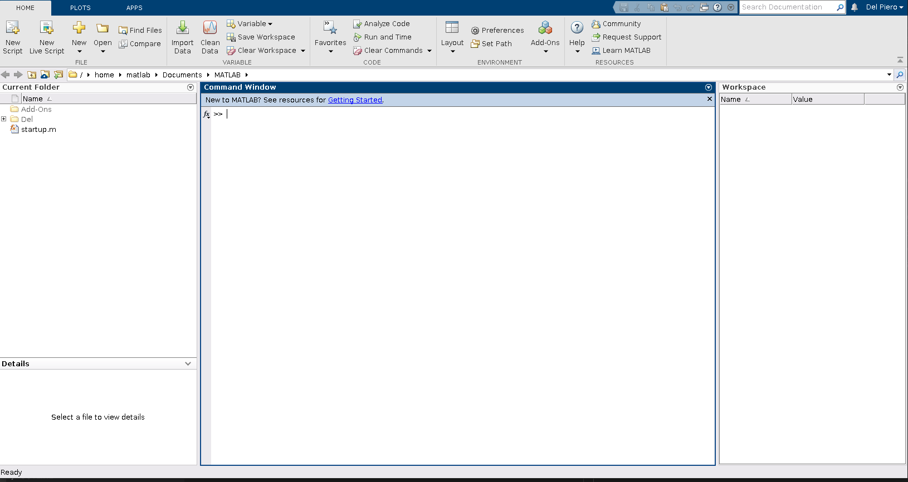
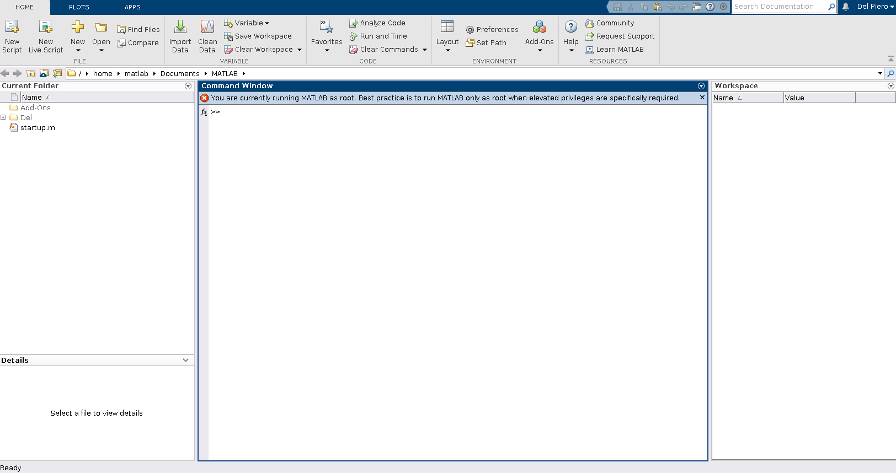

# My tutorials

Este es un repositorio con la única finalidad de guardar los pasos que voy siguiendo al aprender algo nuevo o utilizar algo que probablemente me olvide. Espero que si estás acá, alguna vez te sean de utilidad. 

## Matlab con docker 

Bueno, si bien no hay un tutorial de docker aún, es porque siento que voy a utilizarlo de forma muy seguida por lo que directamente mostraré como utilizar matlab con docker.

Primero es necesario saber que necesitamos docker instalado, pueden hacerlo en la misma página de docker. Luego, corremos 

``` 
xhost +
docker run --name matlab_container -it -e DISPLAY=$DISPLAY -v /tmp/.X11-unix:/tmp/.X11-unix:ro -v ~/Del/docker/Matlab:/home/matlab/Documents/MATLAB/Del --shm-size=512M mathworks/matlab:r2022a
```
 Y acá diré, que rayos es todo esto, así que trataré de explicar masomenos lo que entiendo de todo ello.

 Primero que nada, estamos creando un contenedor con la imagen de matlab 2022a que sea capaz de mostrar la interfaz y todo como si tuviesemos matlab instalado en nuestra computadora. Recuerden que las siguientes caracterísitcas la pueden investigar más a fondo en el sitio oficial de Docker.
 
`xhost +` es importante para permitir a cualquier usuario abrir ventanas en el ordenador.

`--name matlab_container` es el nombre que le asignamos a nuestro contenedor.

`-it` significa que podremos interacturar mediante una pseudoterminal.

`-it` sirve para setear una variable de entorno

`DISPLAY=$DISPLAY` significa que estamos seteando la variable de entorno que define nuestro display al mismo del docker.

`-v` hace referencia a que vamos a alojar un volumen. El primer volumen que alojamos es para que se alojen los recursos gráficos. Por otro lado, el segundo que estamos creando es importante puesto que hace referencia al volumen que iremos a utilizar para compartir los archivos de nuestra computadora local al contenedor en docker. Esto quiere decir que los archivos que yo tenga en la carpeta local `~/Del/docker/Matlab` se irán a compartir en la carpeta `/home/matlab/Documents/MATLAB/Del` del contenedor y viceversa. Por ello les recomiendo cambiar la carpeta local a una dedicada donde vayan a poner sus archivos de matlab, y obviamente el nombre `Del` en la ruta del contenedor a una que ustedes deseen.

`--shm-size=512M` es la cantidad de memoria compartida que será de 512 MB y de acuerdo a MATLAB es la apropiada para que funcione correctamente.

`mathworks/matlab:r2022a` es la imagen de MATLAB, que si no la tienen no se preocupen pues al correr el comando se descargará del DockerHub siempre que tengan internet claro.

Bueno eso es básicamente todo lo que necesitan para correr MATLAB con docker y que puedan compartir archivos fácilmente con su computadora local, al menos de forma básica. Si le han dado a ejecutar verán que les pide pues sus credenciales y una vez eso saldrá MATLAB como si estuviese corriendo en su computadora.



Si observan el lado izquierdo, está la carpeta `Del` que les mencioné en la creación del volumen, lo cual les permitirá compartir sus archivos de forma fácil con su computadora local.

Ahora si cierran la ventana y el contenedor se detiene, para poder abrir de nuevo el mismo contenedor con sus archivos y copnfiguración, ejecutamos

``` 
xhost +
docker start -i matlab_container
```

Entonces cada vez que lo cierren, solo ejecutan eso y pues siempre será el mismo contenedor.


## Instalación de los toolbox

Ahora, MATLAB no es nada sin los toolbox que tiene para instalar. En la interfaz que tenemos podemos acceder a Add-Ons de forma muy facil haciendo click y se abrirá la ventana mostrándonos todos los toolboxes disponibles. SIn embargo, siempre que quedramos instalar uno, Matlab necesariamente tiene que cerrarse. Al cerrarse, el contenedor se detiene y nunca se inicializa la ventana de instalación del toolbox, por lo que simplemente si seguimos así, nunca podremos instalar alguno. Ahora, de seguro por ahí hay una solución efectiva (la verdad no investigué mucho); sin embargo, esta es la que yo ideé para solucionar este problema. 

Mientras nuestro contenedor esté corriendo luego del `docker run`, o si lo volvieron a correr con el `docker start`, entonces en otra terminal ejecutaremos

``` 
docker exec -it matlab_container bash
```

Esto nos permite ejecutar un comando en un contenedor que ya está corriendo, siendo el bash lo que vayamos a correr. Una vez en el bash, ejecutamos

``` 
sudo matlab
```
para ejecutarlo como superusuario y poder instalar cosas pues necesitamos esos permisos. Solo te volverá a solicitar tus credenciales de Matlab y luego se abrirá una nueva ventana de Matlab con permisos de administrador como se muestra a continuación.



Tal vez la única diferencia que vean es ese mensaje con una x roja que nos indica que estamos con el root.

Ahora pues vamos Add-Ons, y con esto ya seremos libres de instalar un toolbox sin problemas pues ahora cuando matlab se cierre, el contenedor no se detiene y procederá la instalación como debe ser. Una vez termines de instalar el toolbox que desees, pues puedes cerrar la terminal donde realizaste el `docker exec`. Ahora solo cierras el matlab del contenedor y vuelves a ejecutar

``` 
docker start -i matlab_container
```

Con esto verás que el toolbox se ha instalado correctamente en tu container y todas las limitaciones que podríamos haber tenido corriendo Matlab con docker se fueron.

## Creación de un Alias

Ahora, solo por si no deseas correr el `docker start` cada vez que quieras usar matlab, pues recomiendo que edites el .bashrc, te vayas al final, y agregues

```
alias matlab="xhost +; docker start -i matlab_container"
```

Con esto, solo tienes que tipear `matlab` en tu terminal y funcionará de la misma forma. Recuerda que si quieres instlar un toolbox, pues tienes que seguir el proceso con el `docker exec`, pero por mi parte eso sería todo.


## Referencias
Algunos links que les sean de utilidad

[MATLAB en docker hub](https://hub.docker.com/r/mathworks/matlab)

[MAthworks: Matlab in containers](https://www.mathworks.com/help/cloudcenter/ug/matlab-container-on-docker-hub.html)
